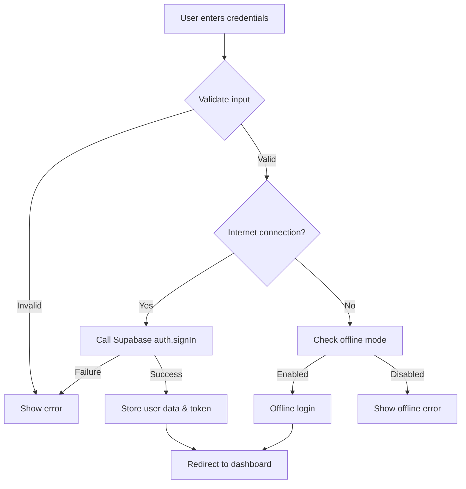
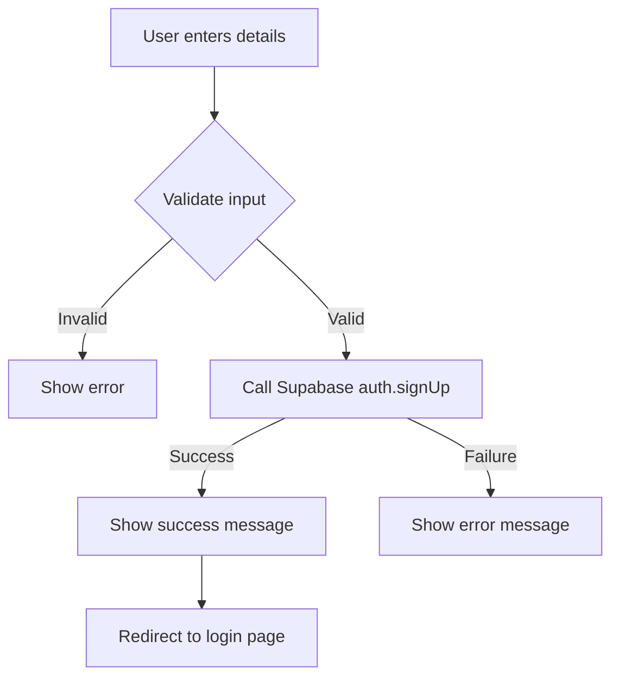
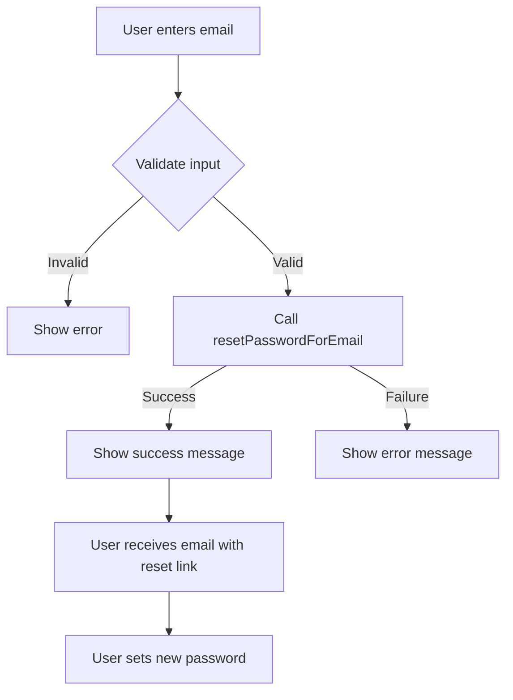
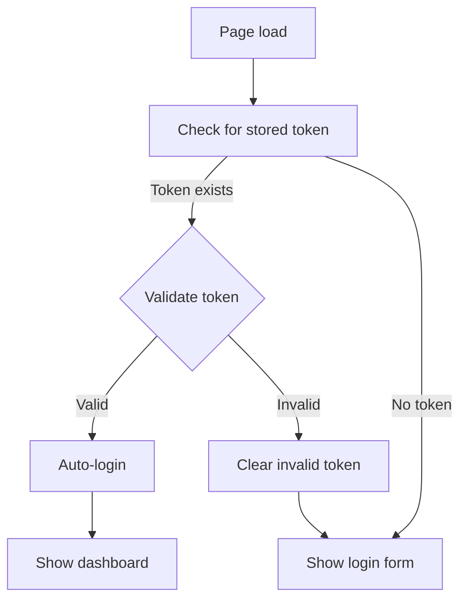

# Login & Authentication Development Guide

## Overview

This document provides a comprehensive guide to the ZMagic12 authentication system. The authentication module manages user login, registration, password recovery, and offline mode support through Supabase authentication.

## Architecture

### Directory Structure
```
core/auth/
├── css/                 # Styling for authentication pages
├── js/
│   ├── auth.js          # Main authentication logic
│   ├── i18n-auth.js     # Internationalization for auth pages
│   └── langs/           # Language files
├── login.html           # Login page
├── register.html        # Registration page
└── password-recovery.html  # Password reset page
```

### Technologies
- **Supabase Auth**: Backend authentication service
- **LocalStorage**: For secure token and user data storage
- **SessionStorage**: For compatibility with existing components

### Authentication Flow
1. **User Authentication**: Login via Supabase authentication
2. **Token Management**: Secure storage of auth tokens with encryption
3. **Session Management**: Auto-login for returning users
4. **Offline Mode**: Fall-back functionality when offline

## Components

### `auth.js`
Core authentication module that handles:
- Supabase client initialization and connection
- User authentication (login, logout, session verification)
- Secure storage of authentication tokens and user data
- Offline mode management
- UI interactions and form submissions

### Authentication Pages
- **login.html**: User login page
- **register.html**: New user registration
- **password-recovery.html**: Password reset functionality

## Key Functions

### Authentication

| Function | File | Description |
|----------|------|-------------|
| `init()` | auth.js | Initializes the authentication system and Supabase connection |
| `checkCurrentSession()` | auth.js | Verifies if a user is already logged in |
| `handleLoginSubmit()` | auth.js | Processes login form submission |
| `isAuthenticated()` | auth.js | Checks if the user has a valid session |
| `storeUserData()` | auth.js | Securely stores user data in local storage |
| `clearAuthData()` | auth.js | Removes authentication data during logout |

### Security

| Function | File | Description |
|----------|------|-------------|
| `encryptData()` | auth.js | Encrypts sensitive user data for storage |
| `decryptData()` | auth.js | Decrypts user data from storage |
| `getAuthToken()` | auth.js | Retrieves and validates the auth token |

### Offline Support

| Function | File | Description |
|----------|------|-------------|
| `isOfflineMode()` | auth.js | Checks if offline mode is active |
| `enableOfflineMode()` | auth.js | Activates offline mode |
| `handleOffline()` | auth.js | Handles offline state changes |
| `createMockClient()` | auth.js | Creates a mock Supabase client for offline use |

## Integration Points

### With Dashboard Module
- After successful login, users are redirected to the dashboard
- User data is passed to the dashboard for personalized content
- Authentication state is maintained across page navigation

### With Project Management
- User ID is used to fetch user-specific projects
- Authentication tokens are used for API requests to Supabase

## Workflows

### Login Process


### Registration Process


### Password Recovery


### Session Management


## Security Considerations

1. **Token Storage**: Authentication tokens are encrypted before storage in localStorage
2. **User Data**: Sensitive user data is encrypted with a security key
3. **Session Expiration**: Tokens are validated for expiration before use
4. **HTTPS**: All authentication requests must use HTTPS
5. **Input Validation**: Client-side validation of all user inputs

## Error Handling

The authentication system includes comprehensive error handling:

1. **Network Errors**: Graceful fallback to offline mode
2. **Authentication Failures**: Clear error messages for users
3. **Token Expiration**: Automatic logout and redirect to login page
4. **Invalid Input**: Form validation with user feedback

## Testing

### Test Accounts
- **Test Mode**: Enable with specific email pattern (test@example.com)
- **Demo Account**: demo@zmagic12.com / password: zmagic12demo

### Testing Offline Mode
1. Disconnect from the internet
2. Attempt to log in with a previously authenticated account
3. Verify offline functionality is available

## Troubleshooting

### Common Issues

1. **Login Failures**
   - Check browser console for specific error messages
   - Verify Supabase service status
   - Clear browser cache and try again

2. **Session Expiration**
   - Default session length is 24 hours
   - Check token expiration in localStorage

3. **Registration Issues**
   - Email address must be unique
   - Password must meet complexity requirements (8+ chars, mixed case)

## Internationalization (i18n)

The authentication system includes comprehensive internationalization support for all authentication pages, including the user profile. The system uses the same language preference stored in localStorage under the key 'locale' that is used by other modules in the application.

### Language Support

The authentication system supports the following languages:
- **Portuguese (Portugal)** - pt-PT (default)
- **English (US)** - en-US
- **French (France)** - fr-FR  
- **Spanish (Spain)** - es-ES
- **German (Germany)** - de-DE
- **Chinese (Simplified)** - zh-CN

### Implementation Details

1. **Internationalization Manager**: The file `js/i18n-auth.js` handles all translation logic
2. **Language Files**: Translations are stored in `js/langs/[lang-code].js` files
3. **DOM Integration**: HTML elements use `data-i18n` and `data-i18n-attr` attributes for translation
4. **Shared Preferences**: Uses the same 'locale' key in localStorage as other modules

### User Profile Internationalization

The user profile page (`profile.html`) has been fully internationalized with:
- Translated interface elements (tabs, labels, buttons) 
- Support for all 6 languages
- Consistent translation keys following the same pattern as other authentication pages
- Automatic language switching based on the user's preference

### How it Works

1. When the profile page loads, it initializes the i18n system by calling `Auth_I18n.init()`
2. The system reads the current language preference from localStorage
3. The appropriate language file is loaded
4. All elements with `data-i18n` attributes are translated to the selected language
5. Dynamic content is translated when updated using translation helper functions

### Extending Translations

To add new translatable text to the profile page:
1. Add the element with appropriate `data-i18n` attribute
2. Add the corresponding translation key to all language files in `js/langs/`
3. Follow the established hierarchical structure (e.g., `profile.fields.new_field`)

## Future Enhancements

1. **Social Login**: Integration with Google, GitHub, and other OAuth providers
2. **Two-Factor Authentication**: Additional security layer
3. **Remember Me**: Extended session duration option
4. **Password Strength Meter**: Visual feedback during registration
5. **Account Management**: Self-service profile updates and password changes

## Integration with Ribbon

The authentication system integrates with the application's Ribbon interface to provide a seamless logout experience throughout the application.

### Ribbon Logout Implementation

- **Component**: The logout functionality is implemented in `public/components/ribbon/js/ribbon-actions.js`
- **Configuration**: The logout button is configured in `public/components/ribbon/config/ribbon-config.js`
- **Action Name**: The Ribbon action `exitAccount` is mapped to the authentication logout function

### Logout Flow from Ribbon

```mermaid
flowchart TD
    A[User clicks Logout button in Ribbon] --> B[ribbon:action event with exitAccount]
    B --> C[RibbonActions.exitAccount() method]
    C --> D{AuthManager available?}
    D -->|Yes| E[Call AuthManager.logout()]
    D -->|No| F[Fallback: Clear localStorage]
    E --> G[Redirect to login.html]
    F --> G
```

The implementation allows users to logout from any page in the application where the Ribbon is present, without needing to navigate to a dedicated logout page.

### Technical Implementation

The Ribbon's logout action connects to the AuthManager via the following code:

```javascript
exitAccount() {
    console.log('[RIBBON-ACTIONS] Executando ação de logout (exitAccount)');
    
    try {
        // Verificar se o AuthManager está disponível
        if (window.AuthManager && typeof window.AuthManager.logout === 'function') {
            console.log('[RIBBON-ACTIONS] AuthManager encontrado, executando logout');
            
            // Executar o logout através do AuthManager
            window.AuthManager.logout()
                .then(() => {
                    console.log('[RIBBON-ACTIONS] Logout realizado com sucesso');
                    
                    // Redirecionar para a página de login
                    window.location.href = '/core/auth/login.html';
                })
                .catch(error => {
                    console.error('[RIBBON-ACTIONS] Erro ao executar logout:', error);
                    alert('Erro ao fazer logout. Por favor, tente novamente.');
                });
        } else {
            console.error('[RIBBON-ACTIONS] AuthManager não disponível para logout');
            
            // Tentar abordagem alternativa: limpar localStorage e redirecionar
            localStorage.removeItem('userData');
            localStorage.removeItem('authToken');
            localStorage.removeItem('supabase.auth.token');
            
            // Redirecionar para a página de login
            window.location.href = '/core/auth/login.html';
        }
    } catch (error) {
        console.error('[RIBBON-ACTIONS] Erro ao processar ação de logout:', error);
        
        // Em caso de erro, tentar redirecionar para login
        window.location.href = '/core/auth/login.html';
    }
}
```

### Benefits of Integration

- **Unified Logout Experience**: Same logout mechanism throughout the application
- **Error Handling**: Multiple fallback mechanisms in case of errors
- **Security**: Ensures all user data and tokens are properly cleared
- **Debugging**: Comprehensive logging for easier troubleshooting
- **User Feedback**: Clear visual feedback on logout success or failure

## Security and Row Level Security (RLS)

O sistema de autenticação integra-se com as políticas de Row Level Security (RLS) do PostgreSQL no Supabase para garantir a segurança dos dados do usuário.

### Como a Autenticação Interage com RLS

1. **Token JWT**: Quando um usuário se autentica com sucesso, o Supabase gera um token JWT que contém o ID do usuário (auth.uid).
2. **Uso do Token**: Este token é armazenado em `localStorage` (criptografado) e utilizado em todas as requisições subsequentes ao banco de dados.
3. **Aplicação de Políticas**: O Supabase utiliza automaticamente o ID do usuário contido no token para aplicar as políticas RLS.

### Adaptabilidade a Esquemas de Banco de Dados

O sistema de autenticação é projetado para funcionar mesmo quando certas tabelas estendidas, como `profiles`, não estão disponíveis no banco de dados. Esta característica é especialmente importante durante implantações progressivas ou migrações de banco de dados.

#### Dados de Autenticação vs. Dados de Perfil

O sistema separa claramente entre:

1. **Dados de Autenticação Essenciais**: Armazenados na tabela `auth.users` gerenciada pelo Supabase Auth
   - Email do usuário
   - ID do usuário
   - Data de criação da conta
   - Último acesso

2. **Dados de Perfil Estendidos**: Armazenados na tabela opcional `public.profiles`
   - Nome completo  
   - URL do avatar
   - Preferências do usuário
   - Informações adicionais

#### Funcionamento sem a Tabela de Perfis

Quando a tabela `profiles` não está disponível:

1. O sistema de login continua funcionando normalmente
2. As informações básicas do usuário são extraídas diretamente de `auth.users`
3. O nome de exibição é derivado do email (parte antes do @)
4. Um avatar padrão é utilizado
5. Logs detalhados são gerados para facilitar a depuração

#### Implementação no UserManager

O componente `UserManager` no Dashboard implementa a lógica de verificação e adaptação ao estado do banco de dados:

```javascript
// Verifica se a tabela profiles existe
async checkProfilesTable() {
    try {
        const { data, error } = await this.supabase
            .from('profiles')
            .select('count')
            .limit(1);
        
        this.profilesTableExists = !error;
    } catch (error) {
        this.profilesTableExists = false;
    }
}
```

## Esquema do Banco de Dados de Usuários

O sistema de autenticação utiliza a tabela `auth.users` do Supabase para gerenciar dados de usuários. Abaixo está a definição completa da tabela:

```sql
CREATE TABLE auth.users (
  instance_id uuid NULL,
  id uuid NOT NULL,  -- Chave primária
  aud character varying(255) NULL,
  role character varying(255) NULL,
  email character varying(255) NULL,  -- Obrigatório
  encrypted_password character varying(255) NULL,  -- Obrigatório
  email_confirmed_at timestamp with time zone NULL,
  invited_at timestamp with time zone NULL,
  confirmation_token character varying(255) NULL,
  confirmation_sent_at timestamp with time zone NULL,
  recovery_token character varying(255) NULL,
  recovery_sent_at timestamp with time zone NULL,
  email_change_token_new character varying(255) NULL,
  email_change character varying(255) NULL,
  email_change_sent_at timestamp with time zone NULL,
  last_sign_in_at timestamp with time zone NULL,
  raw_app_meta_data jsonb NULL,
  raw_user_meta_data jsonb NULL,
  is_super_admin boolean NULL,
  created_at timestamp with time zone NULL,  -- Data de criação
  updated_at timestamp with time zone NULL,  -- Data da última atualização
  phone text NULL DEFAULT NULL::character varying,  -- Opcional
  phone_confirmed_at timestamp with time zone NULL,
  phone_change text NULL DEFAULT ''::character varying,
  phone_change_token character varying(255) NULL DEFAULT ''::character varying,
  phone_change_sent_at timestamp with time zone NULL,
  confirmed_at timestamp with time zone GENERATED ALWAYS AS (LEAST(email_confirmed_at, phone_confirmed_at)) STORED NULL,
  email_change_token_current character varying(255) NULL DEFAULT ''::character varying,
  email_change_confirm_status smallint NULL DEFAULT 0,
  banned_until timestamp with time zone NULL,
  reauthentication_token character varying(255) NULL DEFAULT ''::character varying,
  reauthentication_sent_at timestamp with time zone NULL,
  is_sso_user boolean NOT NULL DEFAULT false,
  deleted_at timestamp with time zone NULL,
  is_anonymous boolean NOT NULL DEFAULT false,
  full_name text NOT NULL,  -- Obrigatório
  organization_name text NULL,  -- Opcional
  phone_number text NULL,  -- Opcional
  country text NULL,  -- Opcional
  user_type text NULL,  -- Opcional
  subscription_start_date TIMESTAMP WITH TIME ZONE NOT NULL,  -- Obrigatório
  subscription_validity INTERVAL NOT NULL,  -- Obrigatório
  subscription_plan TEXT NOT NULL,  -- Obrigatório
  terms_accepted BOOLEAN NOT NULL DEFAULT FALSE,  -- Obrigatório
  newsletter_subscribed BOOLEAN DEFAULT FALSE,  -- Opcional
  CONSTRAINT users_pkey PRIMARY KEY (id),
  CONSTRAINT users_phone_key UNIQUE (phone),
  CONSTRAINT users_email_change_confirm_status_check CHECK (((email_change_confirm_status >= 0) AND (email_change_confirm_status <= 2)))
);
```

### Campos de Usuário Obrigatórios e Opcionais

A tabela `auth.users` contém uma mistura de campos gerenciados pelo Supabase e campos personalizados para a aplicação. Os principais campos utilizados pelo sistema de perfil são:

#### Campos Obrigatórios
- `id`: Identificador único do usuário (gerado automaticamente)
- `email`: Email do usuário (usado para login)
- `encrypted_password`: Senha criptografada (gerenciada pelo Supabase)
- `full_name`: Nome completo do usuário
- `subscription_start_date`: Data de início da assinatura
- `subscription_validity`: Duração da assinatura (intervalo PostgreSQL)
- `subscription_plan`: Plano de assinatura do usuário
- `terms_accepted`: Indicador de aceitação dos termos de uso

#### Campos Opcionais
- `organization_name`: Nome da organização do usuário
- `phone_number`: Número de telefone do usuário
- `country`: País do usuário
- `user_type`: Tipo de usuário no sistema (usado para permissões)
- `newsletter_subscribed`: Preferência para receber newsletter
- `role`: Função do usuário no sistema (padrão: 'authenticated')
- `created_at`: Data de criação da conta
- `last_sign_in_at`: Data do último login

### Acesso e Exibição de Dados no Perfil do Usuário

O sistema de perfil do usuário (`core/auth/profile.html` e `core/auth/js/profile.js`) foi projetado para acessar e exibir todos os campos relevantes da tabela `auth.users`. O perfil é dividido em quatro seções:

1. **Informações Pessoais**:
   - Nome completo (`full_name`)
   - Organização (`organization_name`)
   - Telefone (`phone_number`)
   - País (`country`)
   - Preferência de newsletter (`newsletter_subscribed`)

2. **Configurações da Conta**:
   - Email (`email`) - somente leitura
   - Função (`role`) - somente leitura
   - Data de criação (`created_at`) - somente leitura
   - Último acesso (`last_sign_in_at`) - somente leitura
   - Status dos termos (`terms_accepted`) - somente leitura

3. **Atividade da Conta**:
   - Estatísticas de uso (projetos, templates, formulários)
   - Histórico de atividade (baseado em logs)

4. **Assinatura**:
   - Plano atual (`subscription_plan`)
   - Data de início (`subscription_start_date`)
   - Validade/Duração (`subscription_validity`)

### Persistência Local de Dados do Perfil

Para garantir a disponibilidade dos dados mesmo quando há problemas de conectividade ou limitações na API do Supabase, o sistema implementa um mecanismo de fallback usando `localStorage`:

1. Quando o usuário salva alterações no perfil, os dados são:
   - Enviados para o Supabase via `auth.updateUser()` para atualizar `user_metadata`
   - Armazenados no `localStorage` com uma chave específica para o usuário

2. Ao carregar o perfil, o sistema verifica dados em três fontes, com a seguinte ordem de prioridade:
   - Dados do `localStorage` (mais recentes e confiáveis)
   - Dados de `user_metadata` do objeto de usuário do Supabase
   - Dados do objeto principal de usuário

Este mecanismo de três camadas garante a melhor experiência do usuário, mesmo quando há limitações na API ou problemas de conectividade.

## Integração com o Sistema de Comandos do Ribbon

O sistema de autenticação está integrado com o mecanismo de comunicação entre o Ribbon e os módulos, permitindo ações relacionadas à autenticação diretamente da interface principal.

### Implementação de Comandos

O módulo de autenticação não recebe comandos diretamente, mas influencia o sistema de Ribbon das seguintes maneiras:

1. **Propagação do Estado de Autenticação**: Quando um usuário faz login, o sistema de autenticação dispara um evento `user:login` que é capturado pelo Ribbon, permitindo que a interface seja atualizada.

2. **Controle de Acesso aos Comandos**: O Ribbon verifica o estado de autenticação antes de permitir o envio de comandos para módulos que exigem autenticação.

3. **Redirecionamento após Login**: O sistema de autenticação configura redirecionamentos para as páginas apropriadas após o login bem-sucedido, incluindo páginas que contêm o Ribbon.

### Comandos Relacionados à Autenticação

No arquivo de configuração do Ribbon, os seguintes botões estão relacionados à autenticação:

```javascript
{
  id: 'logout-btn',
  icon: 'icon-logout',
  label: 'Logout',
  action: 'exitAccount'
}
```

Este botão, quando clicado, executa a ação de logout que encerra a sessão do usuário.

### Extensão do Sistema

Para adicionar novas funcionalidades relacionadas à autenticação no Ribbon:

1. Adicione um novo botão na configuração do Ribbon
2. Implemente o handler correspondente que interage com o sistema de autenticação
3. Teste a integração para garantir que o estado de autenticação seja corretamente propagado

## Integração com o Sistema de Perfil

O sistema de autenticação está diretamente integrado com o módulo de perfil de usuário, permitindo uma experiência coesa e consistente.

### Organização do Código do Perfil

O sistema de perfil de usuário segue uma estrutura modular com clara separação de responsabilidades:

- **Estrutura (HTML)**: `core/auth/profile.html` - Contém exclusivamente a marcação HTML sem estilos inline
- **Estilo (CSS)**: `core/auth/css/profile.css` - Contém todas as regras de estilo aplicadas ao perfil
- **Comportamento (JS)**: `core/auth/js/profile.js` - Contém toda a lógica de interação e gerenciamento de dados

Esta organização modular traz diversos benefícios:
- Facilita a manutenção do código
- Melhora o desempenho através do caching eficiente do CSS
- Garante consistência visual em todo o sistema
- Simplifica a depuração em caso de problemas

### Campos da Tabela auth.users

O perfil do usuário utiliza os seguintes campos da tabela `auth.users` do Supabase:

- `id`: ID único do usuário (UUID)
- `email`: E-mail principal do usuário (utilizado para login)
- `full_name`: Nome completo do usuário
- `organization_name`: Nome da organização do usuário
- `phone_number`: Número de telefone de contato
- `country`: País de origem
- `user_type`: Tipo/categoria de usuário no sistema
- `role`: Função/papel do usuário no sistema
- `created_at`: Data de criação da conta
- `last_sign_in_at`: Data do último acesso

### Fluxo de Autenticação e Perfil

1. **Login do Usuário**:
   - Quando um usuário faz login, o sistema de autenticação valida as credenciais
   - Após autenticação bem-sucedida, o token JWT é armazenado no localStorage
   - O Ribbon carrega os dados básicos do usuário e exibe o e-mail com o ícone de perfil

2. **Acesso ao Perfil**:
   - O usuário pode acessar seu perfil clicando no ícone de engrenagem no Ribbon
   - O modal de perfil é carregado em um iframe
   - Os dados são carregados diretamente da tabela `auth.users` usando o token JWT

3. **Atualização de Dados**:
   - Alterações no perfil são salvas através da API `auth.updateUser()` do Supabase
   - O token JWT é automaticamente atualizado quando necessário
   - Os módulos são notificados sobre alterações relevantes no perfil

### Integração Técnica

O sistema de login e o módulo de perfil compartilham as seguintes características:

1. **Cliente Supabase Compartilhado**:
   - Ambos utilizam o mesmo cliente Supabase com a mesma configuração
   - O token de autenticação é compartilhado entre todos os componentes

2. **Consistência de Dados**:
   - Os dados do usuário são atualizados de forma consistente em todo o sistema
   - O perfil reflete sempre o estado atual da sessão autenticada

3. **Recuperação de Senha**:
   - O módulo de perfil permite solicitar redefinição de senha
   - O sistema de login processa os tokens de redefinição de senha

4. **Organização de Código Modular**:
   - Ambos os sistemas seguem o mesmo padrão de organização:
     - Arquivos HTML para estrutura (`profile.html`, `login.html`, etc.)
     - Arquivos CSS para estilos (`profile.css`, `auth.css`)
     - Arquivos JavaScript para comportamento (`profile.js`, `auth.js`)
   - Esta consistência facilita a manutenção e evolução do sistema
   - Os estilos e scripts são carregados externamente, evitando código inline

### Código de Integração

Exemplo de código mostrando como o sistema de autenticação é integrado com o perfil:

```javascript
// No sistema de login
async function performLogin(email, password) {
    const { data, error } = await supabase.auth.signInWithPassword({
        email,
        password
    });
    
    if (error) throw error;
    
    // Notificar o sistema sobre o login bem-sucedido
    window.parent.postMessage({
        type: 'USER_AUTHENTICATED',
        user: data.user
    }, '*');
    
    return data;
}

// No modal de perfil (recebendo dados de usuário)
window.addEventListener('message', (event) => {
    if (event.data && event.data.type === 'LOAD_PROFILE') {
        // Carregar dados do usuário recebidos
        loadUserData(event.data.user);
    }
});
```

---

This guide is maintained by the ZMagic12 development team. For questions or suggestions, contact the team lead. 